# Copyright

Copyright (c) 2025 The Regents of the University of Michigan, IDEAS Lab

*****************************

# MagicDraw API Demonstration

The capabilities of the MagicDraw API for MBSA&E are demonstrated here using a JSON file for an aircraft configuration.
A five-step workflow will be followed:

1. Import the stereotypes for each component
1. Create a system model by importing the ADH
1. Modify the system architecture
1. Export the ADH to a JSON file
1. Import a JSON file after running an analysis

********************

## ADH for Importing

In this demonstration, the ```Step00.json``` file serves as the initial ADH to be imported into MagicDraw.
This JSON file can be found in the same folder as this demonstration file and represents some elements of an aircraft system and the requirements associated with designing an aircraft.

*****************************

## Create a Blank SysML Model

First, open MagicDraw and create a new SysML model.
At this point, only the ```Model``` package exists.

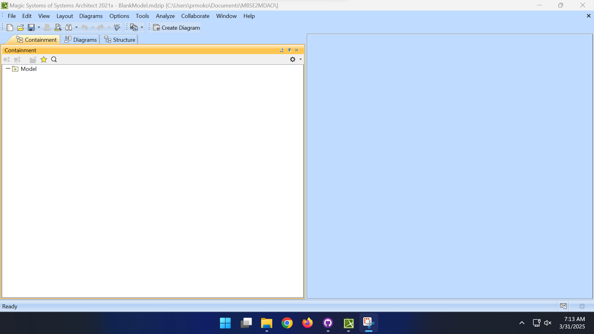

****************************

## Importing the Stereotypes

To import the stereotypes, right-click on the ```Model``` package.
At the bottom of the dropdown menu, there will be multiple options beginning with "MBSA&E".
Since a stereotype profile is being imported, select the "MBSA&E: Import Stereotypes" function.

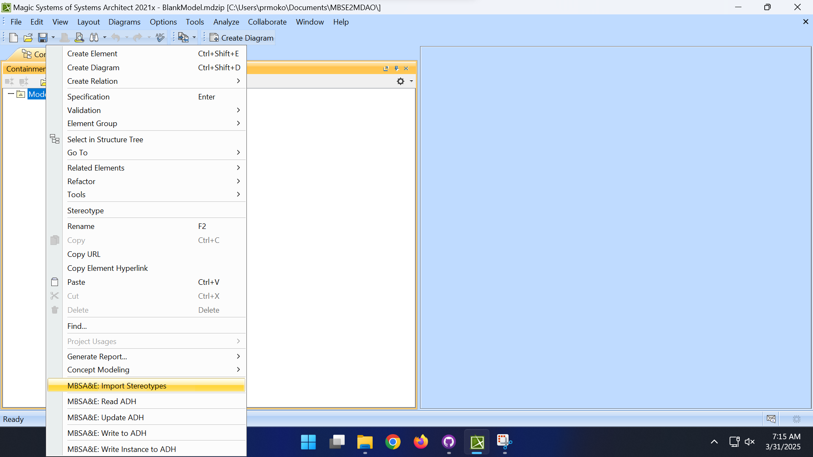

After this, a popup appears to specify the JSON file that should be imported.

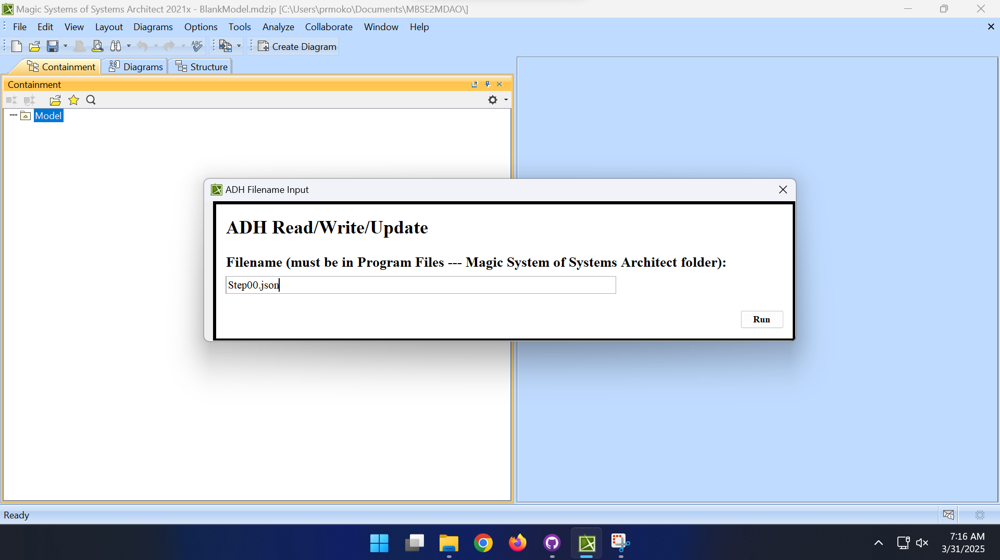

To identify where the JSON file is stored, either input the absolute path to the file, or the path relative to the ```<Root>\Magic Systems of Systems Architect``` folder.
Refer to the README for finding the ```<Root>``` directory.

After the filename is input, select "Run".
Then, the stereotype profile will be imported with the name "ImportADHProfile", as shown in the image below.
Right now, this name is hard-coded into the plugin function.
However, it can easily be added to the popup as another user input in the future.

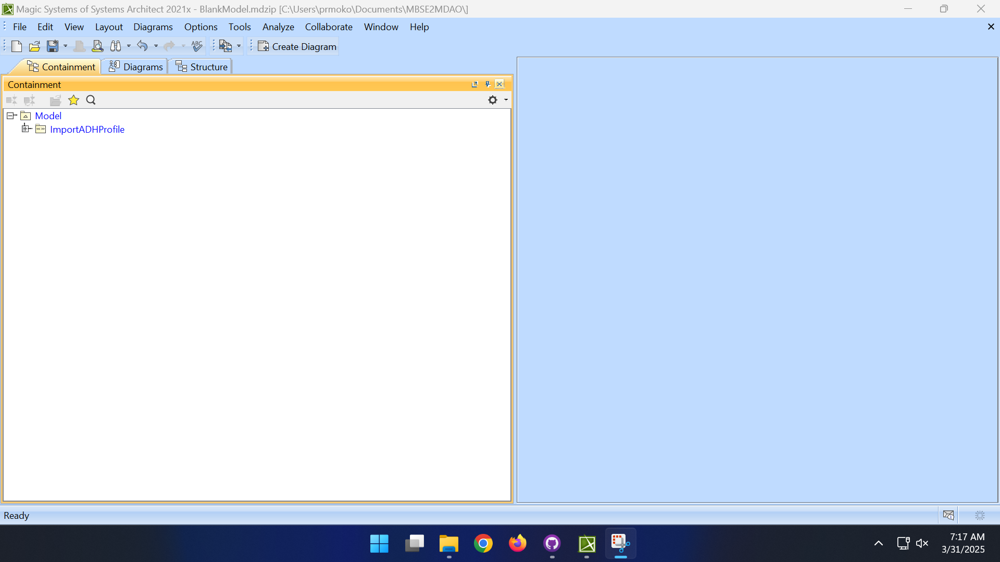

Notice how some of the stereotype names are capitalized and others are not.
This is an artifact of how the ADH was developed.
All names used as key-value pairs were strictly lowercase, but components in an array were formatted with names including uppercase letters.
The stereotypes were imported correctly, and the formatting is not a cause for concern.

************************

## Create a System Model

Now that the stereotypes have been imported, the system model can be created.
To do that, right-click on the ```Model``` package again.
This time, select the "MBSA&E: Read ADH" option.

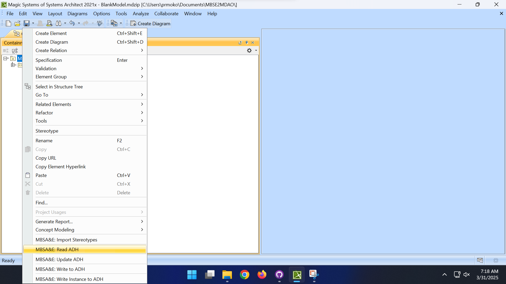

Again, input the name of the JSON file used last time to import the stereotype profile.
(The first import was to create the stereotypes and this import is to create the system model.)
After inputting the file name, click "Run" again.
This time, a package named ```aircraft_system``` appears, which contains all model elements created from the JSON file.

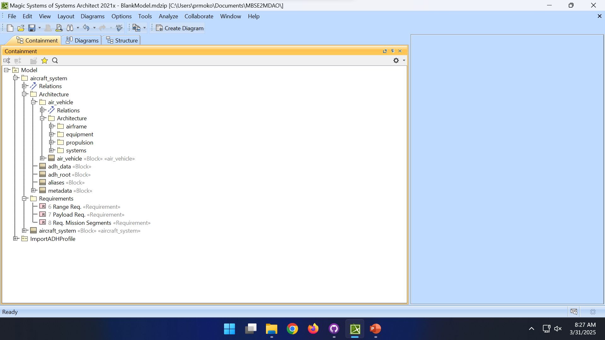

A brief overview of the system model structure is as follows.
For each element in the ADH with a WBS Number (has “wbs_no” as the key), a package and block are made using the “name” key-value pair from the ADH.
Then, within the package, up to four additional packages are made dynamically based on the ADH contents: Architecture, Behavior, Performance, and Requirements.
These packages store all structured data (dictionaries) for a given system/component. However, any singular key-value pairs are created as Value Properties under the block.

*********************************

## Modify the System Architecture

In this step, a component will be added to the system architecture - furnishings and equipment.
This can be done by following the generic model structure described briefly in the previous part of the demonstration.

First, create a package in the appropriate "Architecture" folder for the desired component.
Since furnishings and equipment are being made, the package will reside within the airframe.
After that, create a block with the same name inside of that package.

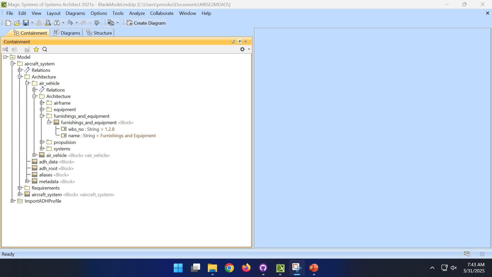

Then, create additional packages to store other information such as the design parameters, requirements, etc.
Recall that the four packages that may be created are "Architecture", "Requirements", "Behavior", and "Performance".
The system model with the component added is shown below.

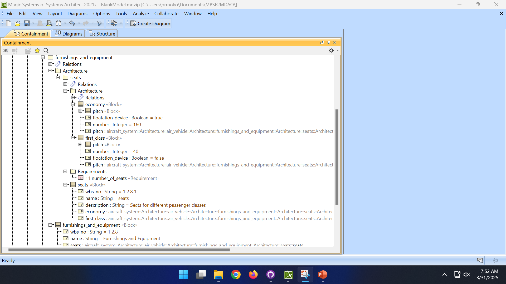

**************************

## Export the System Model

With the new component added the the system model, it can be exported for further analysis.
To do this, right-click on the highest-level package that will be exported and select the "MBSA&E: Write to ADH" option.

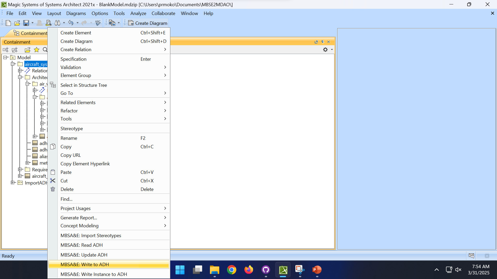

Once the popup opens, write the filepath that the JSON file should be exported to.
For this example, the JSON file is named "Step01.json".
Remember that the filepath must be either the absolute filepath or relative to the ```<Root>\Magic Systems of Systems Architect``` folder.

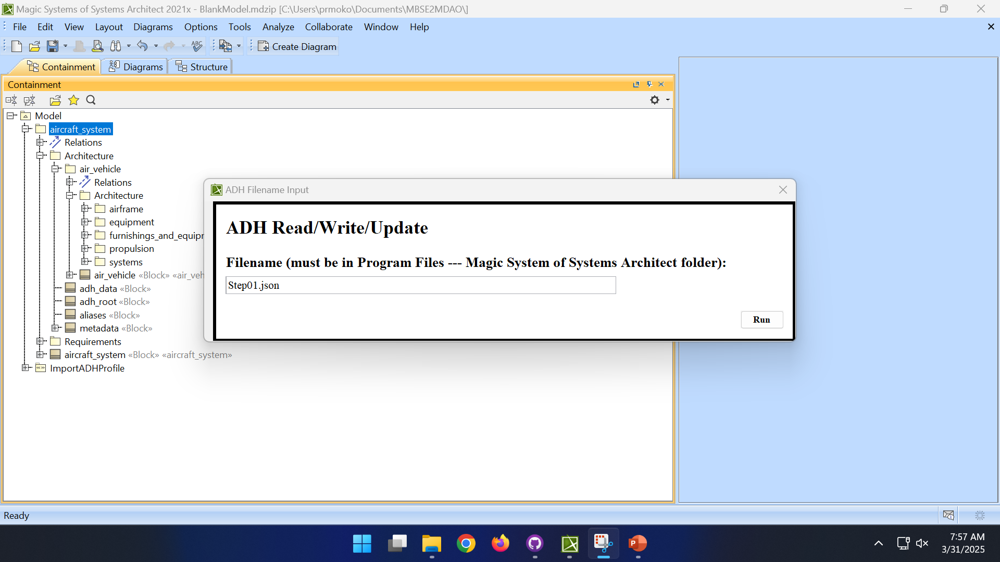

After that, click "Run" and the file will be written to contain all of the previous information in the system model along with the newly added component.

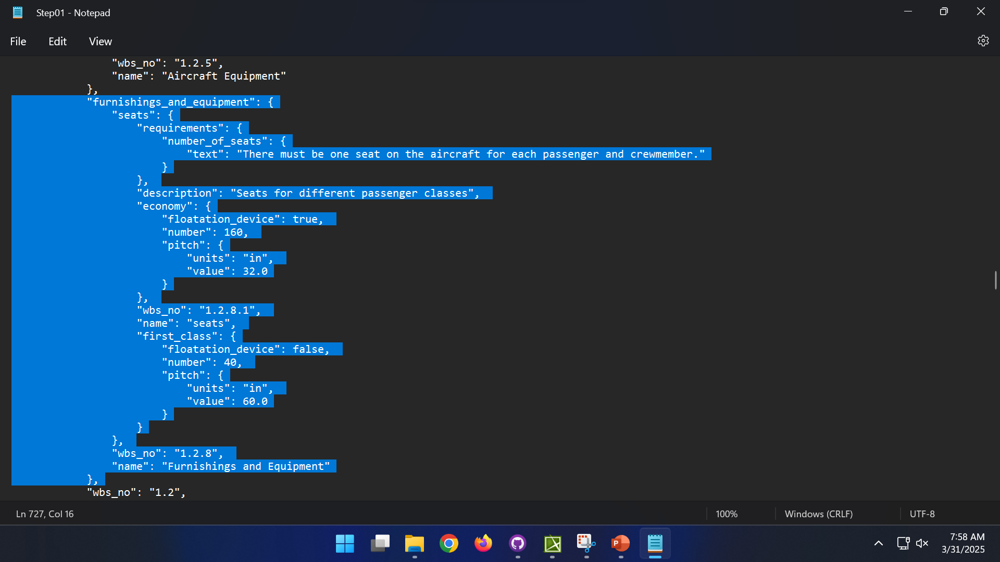

At this stage, an analysis would be run on the configuration using an MBSA tool.
For demonstration purposes, some of the values in the ADH will be changed:

1. The "Req. Mission Segments" requirement now requires two cruise segments at different altitudes
1. The wing's area was decreased to 121.7 sq. m
1. The wing's weight was decreased to 2464.3 kg

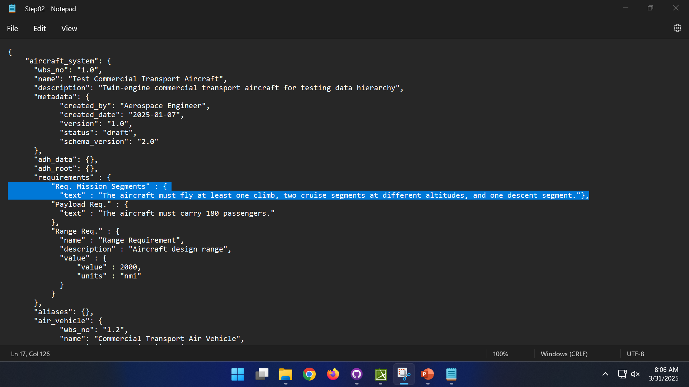
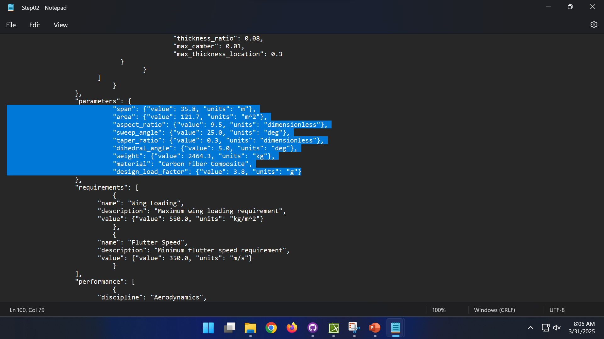

This file is saved as "Step02.json" and will be uploaded back into MagicDraw to represent updating the system model with an analysis run.

*******************************

## Import the Updated JSON File

In the last step of this demonstration, the updated ADH will be loaded into MagicDraw.
To do this, right-click on the highest-level model element (the "aircraft_systems" package) and select the "MBSA&E: Update ADH" option.

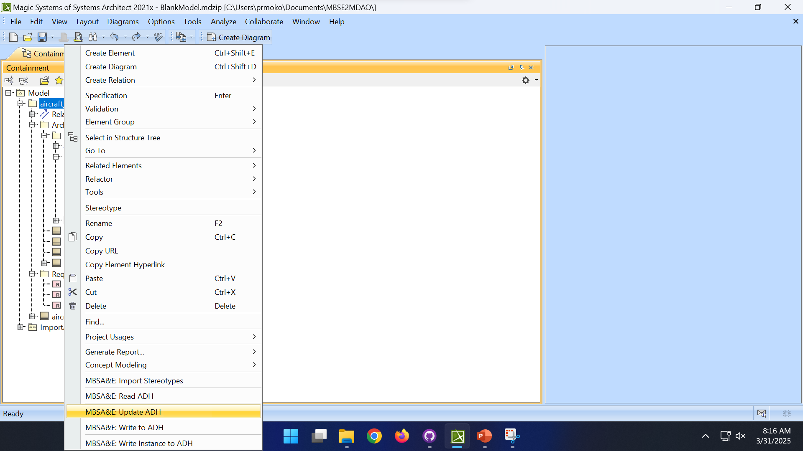

After inputting the appropriate filepath, and clicking "Run", the API will compare the Value Properties in the system model and the newly uploaded file.

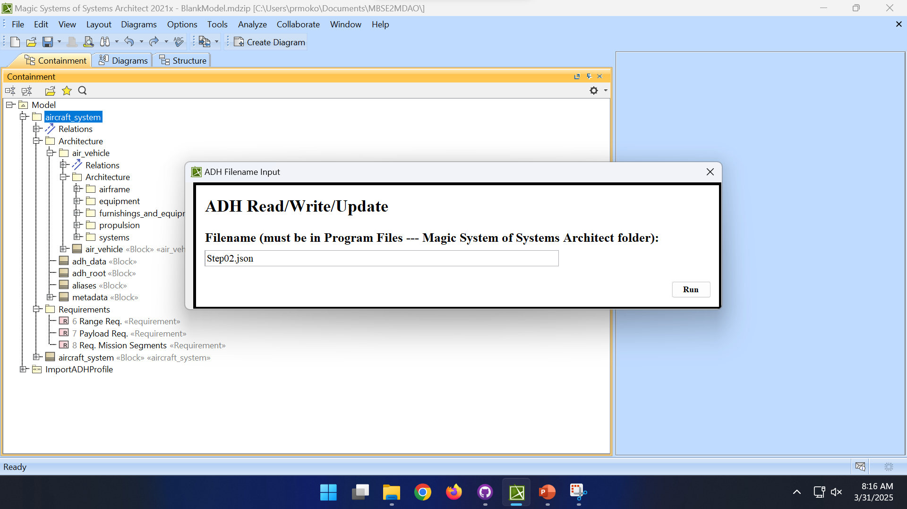

If any values are different, the value from the newly uploaded ADH will overwrite the existing value in the system model.
The updated system model elements are shown in blue.

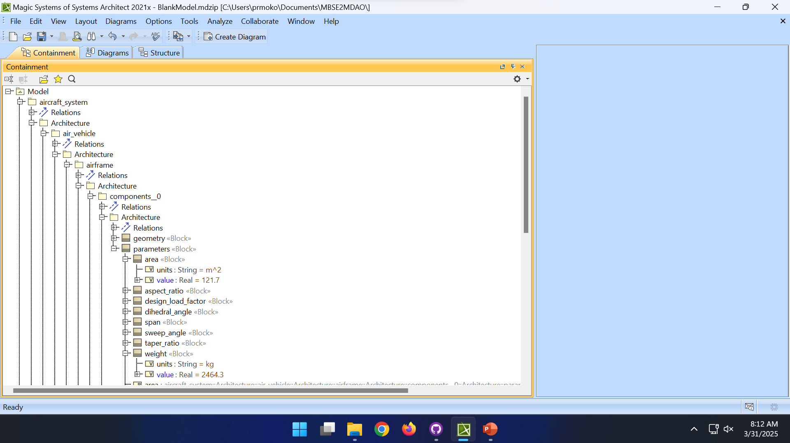
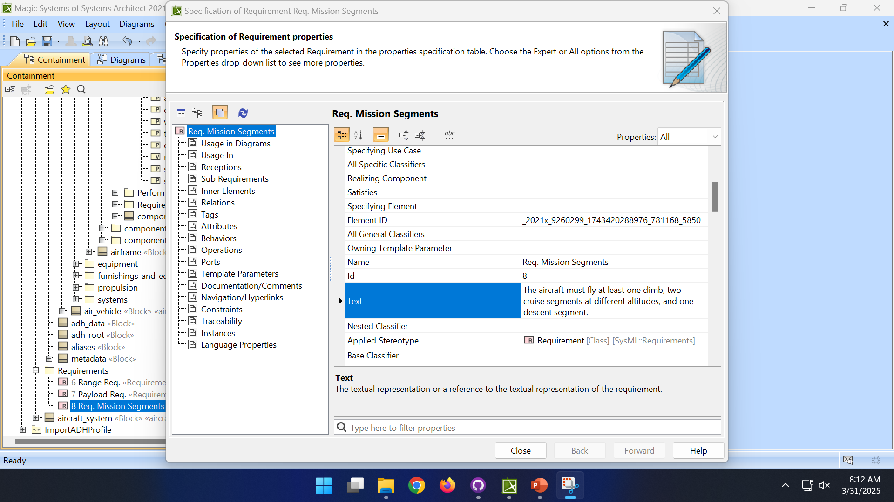

Additionally, any model elements that have been changed will be listed in a separate file, ```<Filename>-ModifiedValues.txt", where the file name is the name of the file that was used in the updating process.
This file contains the qualified name of the model elements changed, the initial value (in the system model), and the updated value (in the ADH).

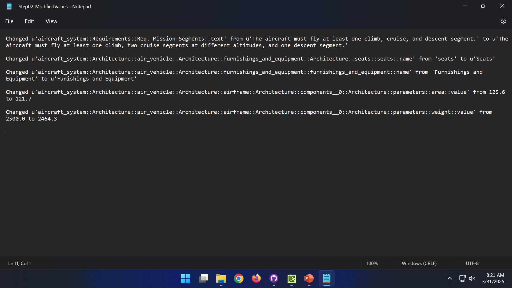

**********************************

# Additional Demonstration Content

Additional capabilities made possible by the API functions written are demonstrated next.
Each of these demonstrations is separate from one another and does not follow continuously like the previous demonstration.

********************************************

## Create a System Model without Stereotypes

The process to create a system model without stereotypes is exactly the same as doing so with a stereotype package.
To do that, right-click on the ```Model``` package and select the "MBSA&E: Read ADH" option again.
After inputting the file path and clicking run, the following warning will appear.

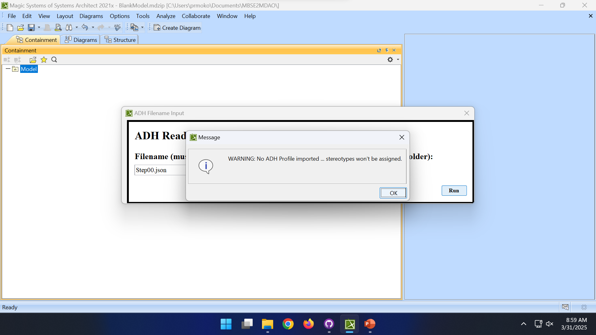

After the warning is acknowledged, the system model is created without stereotyping the blocks.
Everything else in the system model remains the same.

**************************************

## Exporting an Instance Specification

Instance Specifications are useful model elements for creating multiple system architectures with the same components but different design parameters.
This is essential when analyzing multiple configurations in an MBSA tool.
However, they are not exported like other model elements as shown in the main demonstration above.
In this example, there is a simplified version of an ```aircraft_system``` instance.

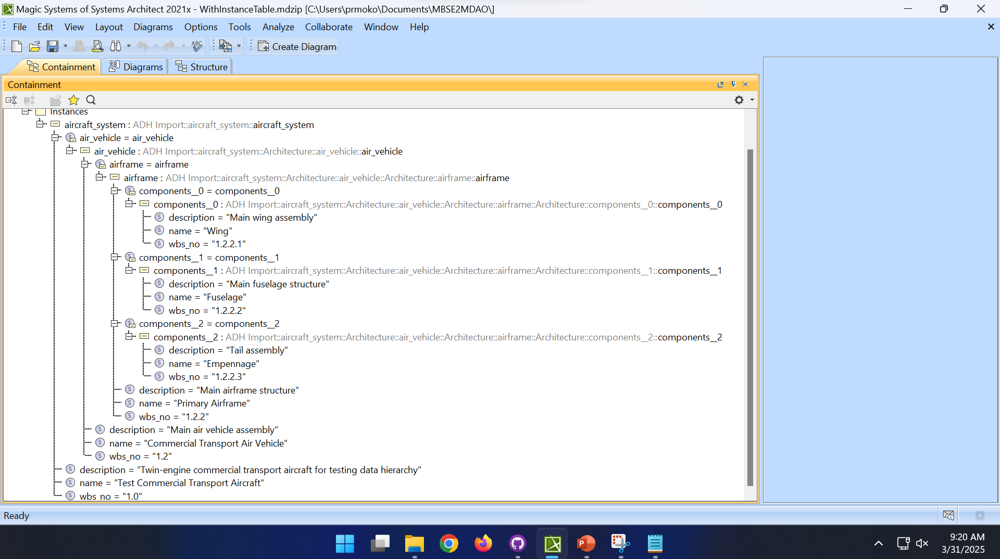

In order to export an Instance Specification, right-click on the desired on and select the "MBSA&E: Write Instance to ADH" option.

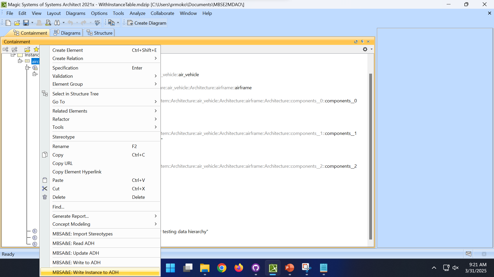

After selecting this option, a popup appears to input the file name of the JSON file ("ExportedInstance.json") that will be created.
Once inputting this, select the "run" option.
The file will be created in the ```<Root>\Magic Systems of Systems Architect``` folder unless another file path is provided.

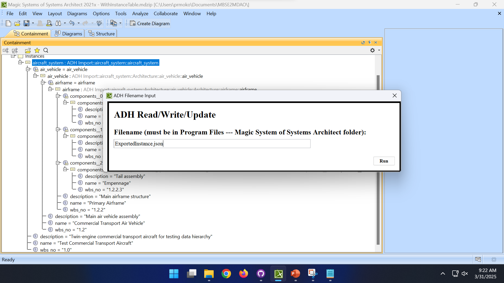

After opening the exported file, you will notice that all of the Instance Specification's slots are written to the JSON file.

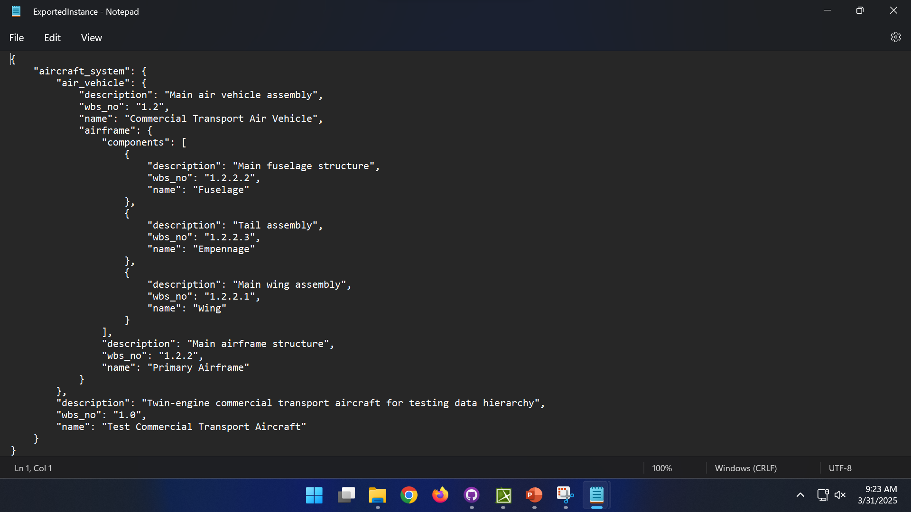